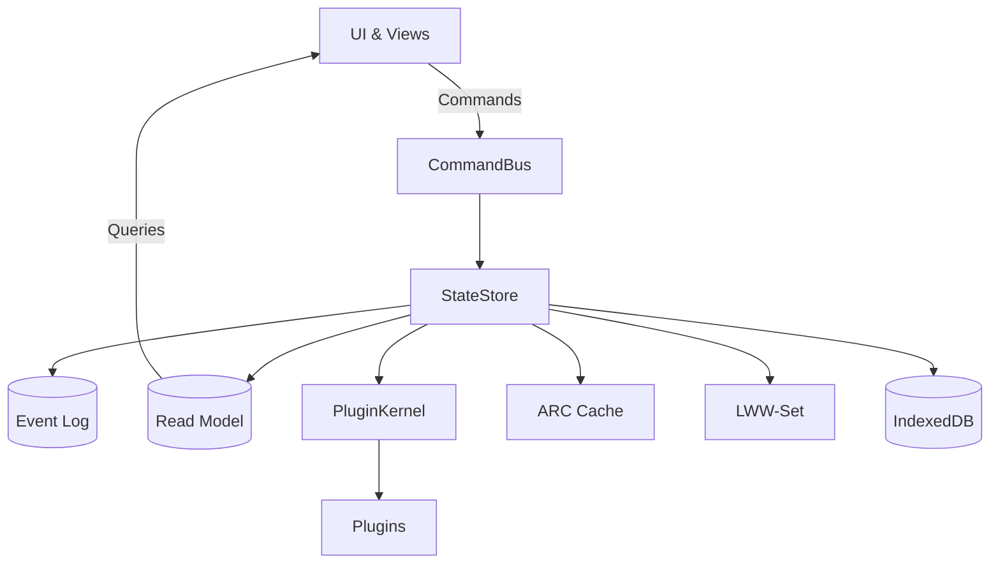
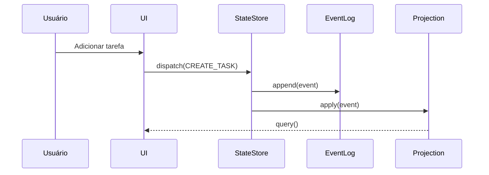

# Arquitetura Técnica — LembraFácil Pro Lab

## Visão geral (Microkernel + Event Sourcing + CQRS)

## Sequência — criação de tarefa

## Estruturas avançadas usadas

- Matriz 4D (urgência × importância × energia × contexto)
- Grafo dirigido (dependências)
- Árvore n-ária (categorias)
- Filas de prioridade (heap binário)
- LRU/ARC (cache adaptativo)
- Lista encadeada (LRU/ARC internamente)

## Padrões aplicados

- Microkernel (PluginKernel)
- Observer (EventBus)
- Strategy (prioridades)
- Factory (TaskFactory)
- CQRS + Event Sourcing (StateStore)
